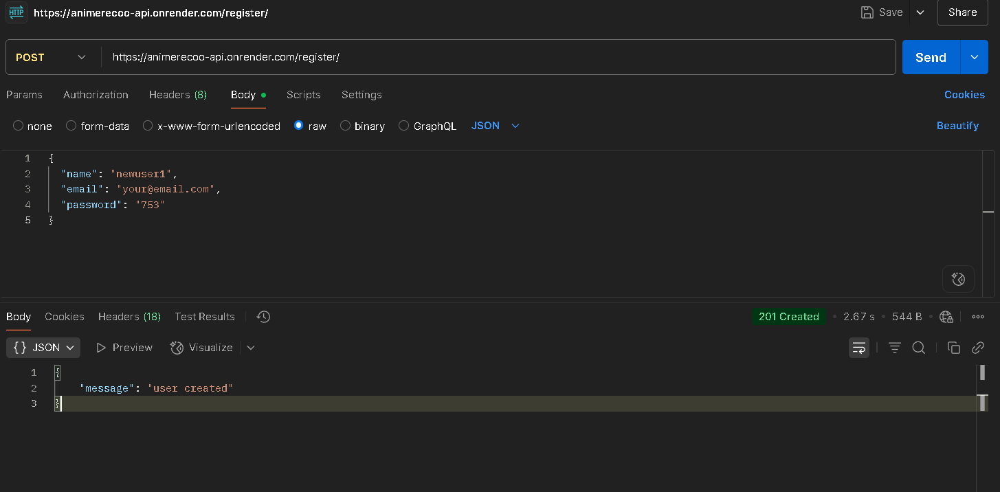
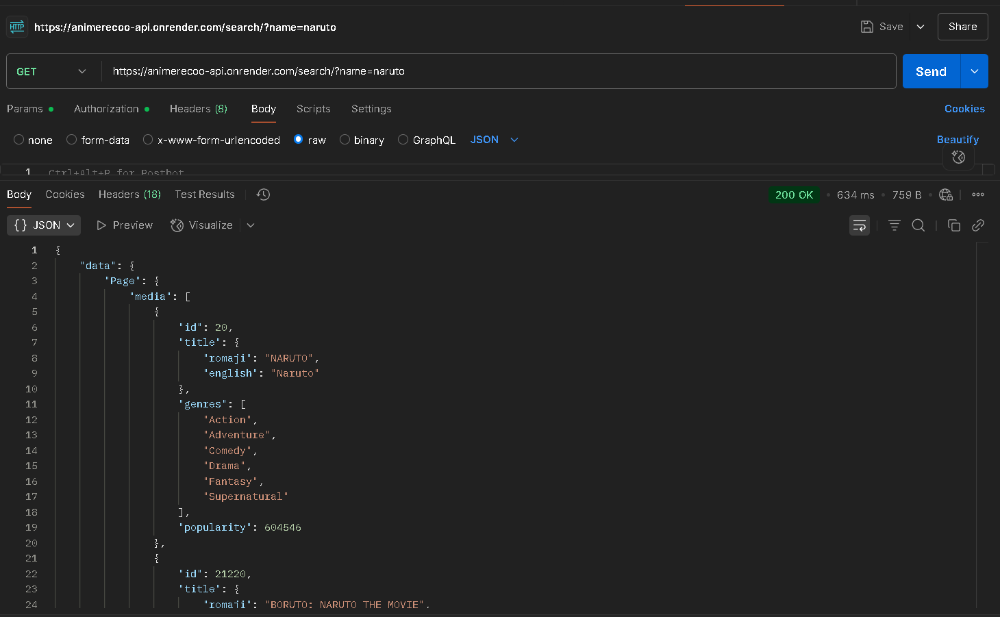
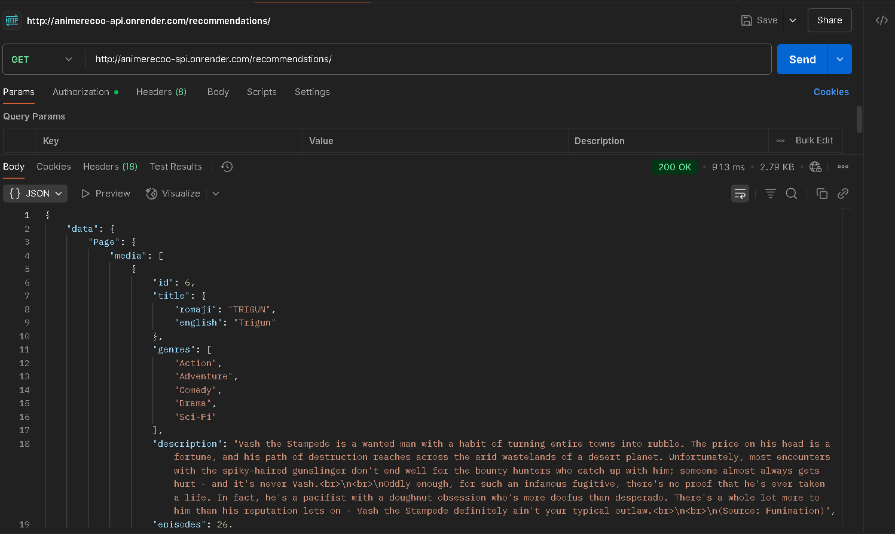
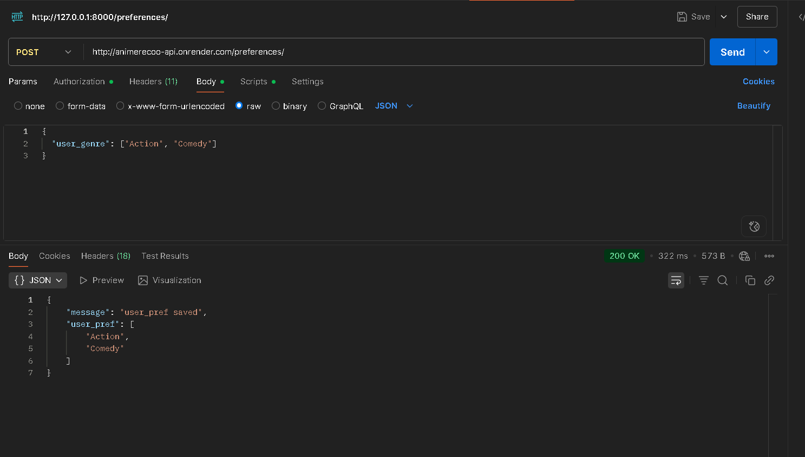
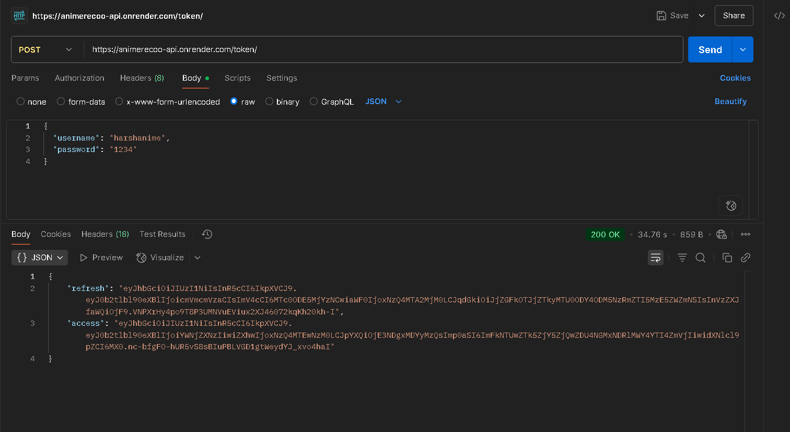

# AnimeReco API

A Django REST API for anime recommendations and management.

## 1. How to Set Up and Run the Project Locally

### Prerequisites
- Python 3.8+
- pip

### Steps
   
1. **Create and activate a virtual environment:**
  
   python -m venv venv
   venv\Scripts\activate   # On Windows
   # or
   source venv/bin/activate   # On Mac/Linux
  
2. **Install dependencies:**
   
   pip install -r requirements.txt
  
3. **Apply migrations:**
   
   python manage.py migrate
  
4. **Create a superuser (for admin access):**
   
   python manage.py createsuperuser
  
5. **Run the development server:**
   
   python manage.py runserver
  
6. **Access the API:**
   - API root: [https://animerecoo-api.onrender.com]
   - Admin: [https://animerecoo-api.onrender.com/admin/]

## 2. REST API Endpoints

| Method | Endpoint             | Description                        |
|--------|----------------------|------------------------------------|
| POST   | /register/           | Register a new user                |
| GET    | /search/?q=...       | Search for anime                   |
| POST   | /recommendations/    | Get anime recommendations          |
|GET/POST| /preferences/        | Set or get user genre preferences  |
| POST   | /token/              | login andObtain JWT token          |
| POST   | /token/refresh/      | Refresh JWT token                  |

## 3. Sample Requests and Responses

### Register a New User

### Search for Anime

### Get Recommendations

### Set User Preferences

### login and Obtain JWT Token

For more details, visit your deployed API at:  
https://animerecoo-api.onrender.com

## Admin Panel
- Visit `/admin/` to manage data via Django admin (login required).

## Static Files
- Static files are served via WhiteNoise in production. Run `python manage.py collectstatic` before deploying.

